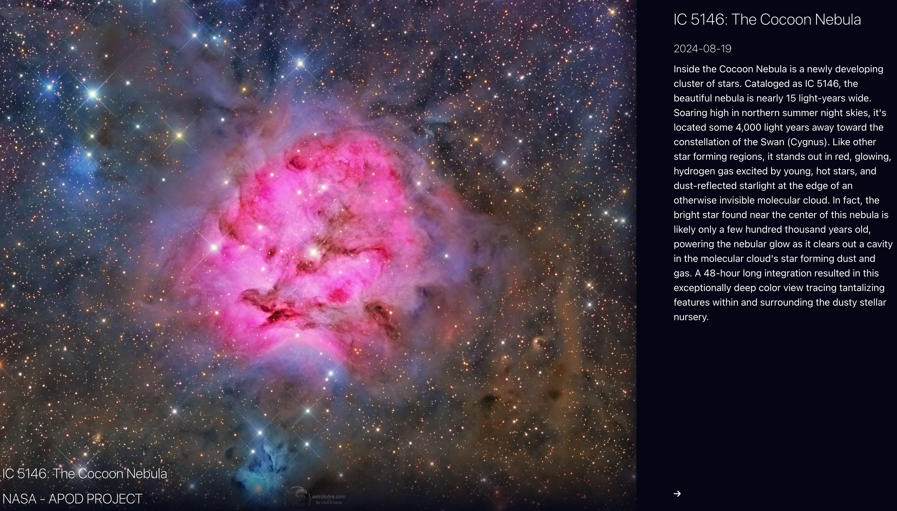

## NASA - Astronomy Picture of the Day :rocket:

### The aim of this personal project was to consume public API & render something dynamic and fun with it, by using React. 

#### Features
* Load dynamic picture for the given day based on NASA's API
* Renders description for it in a modal
* Utilizes caching

#### Deployment & Example
kachamachkov-nasa-apod.netlify.app/

 

